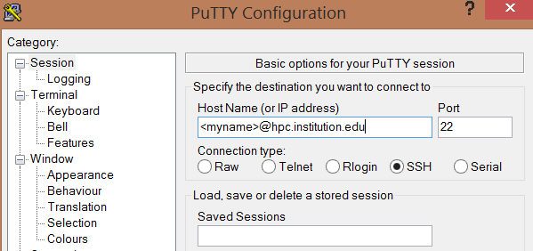
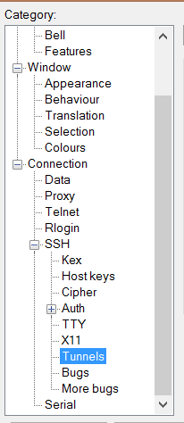
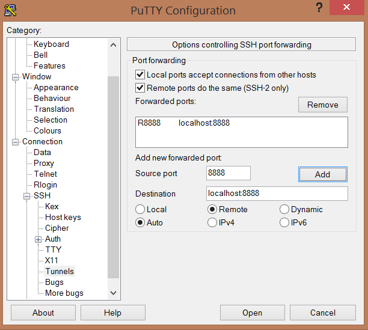

+++
title = "Running Jupyter Notebooks Remotely Using Windows"
subtitle = "Potential workarounds when you don't have a fully-equipped native terminal."

# Add a summary to display on homepage (optional).
summary = ""

date = 2019-07-23T15:25:12-04:00
draft = false

# Authors. Comma separated list, e.g. `["Bob Smith", "David Jones"]`.
authors = []

# Is this a featured post? (true/false)
featured = false

# Tags and categories
# For example, use `tags = []` for no tags, or the form `tags = ["A Tag", "Another Tag"]` for one or more tags.
tags = []
categories = []

# Projects (optional).
#   Associate this post with one or more of your projects.
#   Simply enter your project's folder or file name without extension.
#   E.g. `projects = ["deep-learning"]` references
#   `content/project/deep-learning/index.md`.
#   Otherwise, set `projects = []`.
# projects = ["internal-project"]

# Featured image
# To use, add an image named `featured.jpg/png` to your page's folder.
[image]
  # Caption (optional)
  caption = ""

  # Focal point (optional)
  # Options: Smart, Center, TopLeft, Top, TopRight, Left, Right, BottomLeft, Bottom, BottomRight
  focal_point = ""
+++

Harriet wrote an awesome blog post [here](https://alexanderlabwhoi.github.io/post/2019-03-08_jpn_slurm/) about how to use a Jupyter notebook connected to a remote server via SSH tunneling. Unfortunately, depending on your existing setup on your computer, you may have a few extra steps to wrangle if you have a PC. In this blog post, I'll highlight what you should do after you get the Jupyter notebook running on the remote. In other words, you should have already gotten to the step where you spin up the Jupyter notebook, as in:

```
jupyter notebook --no-browser --port=8888
```

To get to this point, you will have probably used/installed PuTTY or a similar SSH client on your PC. This can be tricky as well if you've never done it before, so if you're having trouble up to this point, I encourage you to check out a tutorial like [this one](https://hostadvice.com/how-to/how-to-configure-putty-ssh-tunnel/).

After you get the jupyter notebook spun up, you're done working on the remote, and you have a few options for how to access some sort of terminal on your computer in order to tunnel the jupyter notebook to your local machine, so that you can use it in your browser like normal. You can set this up via port forwarding in PuTTY, but this limits the ports you can use for either the notebook on the remote or the port you're forwarding to on your own computer. My favorite option is now to use Windows PowerShell, which is a native application on Windows computers (i.e., you get this pre-loaded on your machine). There are a few steps to this, but I think it's ultimately the least amount of pain. I'll also talk about two other options: MinTTY (I prefer to use it through CygWin) and the PuTTY port forwarding option.

## Option 1: Windows PowerShell


Once you get the hang of it, I think of this as the simplest option. I mentioned that PowerShell is a native install on Windows, however, to get some of the newest features, you might have to upgrade to PowerShell 6, which can be done through PowerShell itself. Just open up PowerShell and type:

```
iex "& { $(irm https://aka.ms/install-powershell.ps1) } -UseMSI"
```

This will cause a normal Windows installer a la XP to spin up. The default settings are probably fine, but feel free to choose anything you think you need (don't worry, there aren't too many options). If you had the old version of PowerShell, you'll now need to open a separate window to get to PowerShell 6. It's a bit of a pain, but at least in PowerShell 6 you can paste into the terminal using `Ctrl+V` instead of left click! Silver linings.


*Side note*: you probably (while you're downloading things) want to take this opportunity to download an installer like [scoop](https://scoop.sh/) or [chocolatey](https://chocolatey.org/). I like scoop better, but chocolatey has a nice GUI. It'll make your life easier in the future. You can install scoop, for example, with the following single line on PowerShell 6:

```
iex (new-object net.webclient).downloadstring('https://get.scoop.sh')
```

Now you've got a PowerShell...but you'll probably not be too happy when you try to `ssh`:


There's another step here, but a pretty simple one if you use the power of `git`, which I assume here that you've already got installed on your machine. For most people, Git has `ssh` included and is already installed in the [base executable directory](http://www.hurryupandwait.io/blog/need-an-ssh-client-on-windows-dont-use-putty-or-cygwinuse-git). So instead of installing anything extra, we are just going to add where `ssh` is located via Git to our `$PATH`. Note that we could have done this without PowerShell 6, but note that as a Windows user you're probably going to want PowerShell 6 and Chocolatey/Scoop regardless.

So to add the Git folder we need to the `$PATH`, we run the following two lines:

```
$new_path = "$env:PATH;C:/Program Files/Git/usr/bin"
[Environment]::setEnvironmentVariable("path", $new_path)
```

This is what I found worked best for me. If that in't the location of Git for you (pretty unlikely on a Windows machine), you'll need to go searching for it. The first and easiest line of defense is to go to your C drive and look for related "Program File" locations.

Now, `ssh` should work, and you should be able to use the code that Harriet provided in [her post]() to get your Jupyter notebook tunneled. Try:

```
ssh -t -t <my username>@<some HPC address, such as hpc.mit.edu> -L 8888:localhost:8888 ssh <our node> -L 8888:localhost:8888
```

(Replace the items in brackets with your specific situation). If this gives you issues, a good fix is to put colons before each 8888 instance (after the space). This can help Windows understand that what you're signaling is a port.

You should be good to go! Just type localhost:8888 in your web browser and see if that works. One other thing: if you get a password screen, this isn't your HPC password or anything. This is a Jupyter password. You can either (if you haven't set a password) insert the token that should be displayed (a bunch of letters and numbers) in the remote, or (if you don't see this), you'll need to set a password. Back out of your running Jupyter notebook on the remote, and run `jupyter notebook password`. This will prompt you to write and verify a password, which you'll later enter into the window you see on your local machine, once you set up your SSH tunnel again. If this doesn't work, it might be because the `config` file isn't always created automatically. Run `touch ~/.jupyter/jupyter_notebook_config.json` to solve the issue (you might have to run `mkdir ~/.jupyter` first, depending on just how much isn't set up).

## Option 2: MinTTY

I like using [CygWin](https://cygwin.com/) for manipulating MinTTY (take it from their website: "get that Linux feeling...on Windows" - don't mind if I do!). *Make sure* that you select MinTTY and its associated packages and debuggers when setting up CygWin. This will save you the trouble of having to download MinTTY separately. You also need to make sure `openssh` and associated options are checked. If you forget anything, you can always re-run `setup.exe` from your Downloads or wherever you've placed it. After you go through the motions of selecting a mirror and everything, it'll allow you to update the packages you're using rather than starting completely from scratch.


Now, at this point, you can either run `ssh` directly from the CygWin terminal (you may want to run as administrator just in case when you're starting out), or through MinTTY. Note that you can also use CygWin in place of PuTTY or the like to connect to the remote server you're using in the first place.


Refer to the PowerShell section if you need help with setting up the tunneled Jupyter notebook beyond what is available in the base instructions.

## Option 3: PuTTY

I won't say much about this option, because it's honestly the option I like the least. But if you really want to, you can set up port forwarding directly through your PuTTY session. This way, when you start up your Jupyter notebook on a port, say 8888 like we've been using, it will be automatically tunneled to your local machine (theoretically...but I'd be criticized by PuTTY enthusiasts for adding that caveat!).

First, open up PuTTY and make sure you've got all of your favorite settings loaded in, say by saving your profile.



Next, go to Connection: SSH: Auth: Tunnels.



Next, you need to change a few things. You need to tell PuTTY that your source port is on the remote, and then give the port on the remote as well as the `localhost` port you want to receive the connection:


You also need to check the two boxes up top to make sure the ports are listening to each other (I forgot this while I was constructing this post).



If this worked, you should be all set. Just make sure the ports match. I don't have a lot of luck with this and in the past I've used Firefox port forwarding to get it to work. Chrome is my browser of choice, so for multiple reasons I prefer options 1 and 2 in this post!
